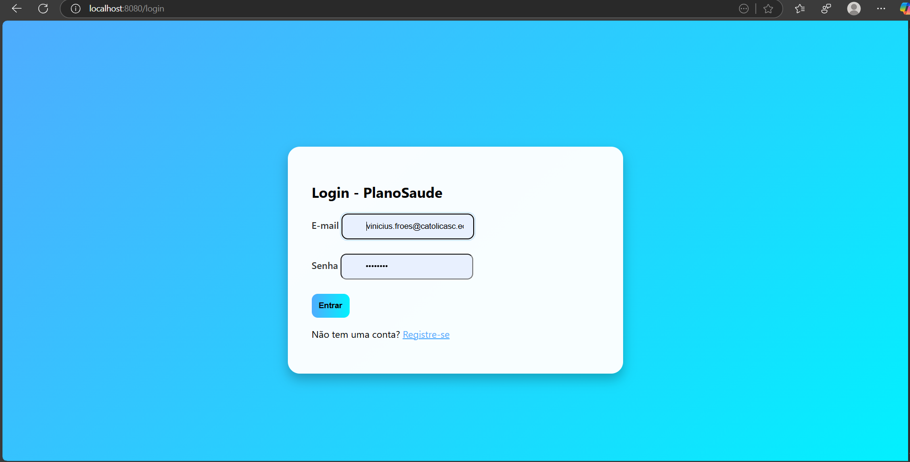
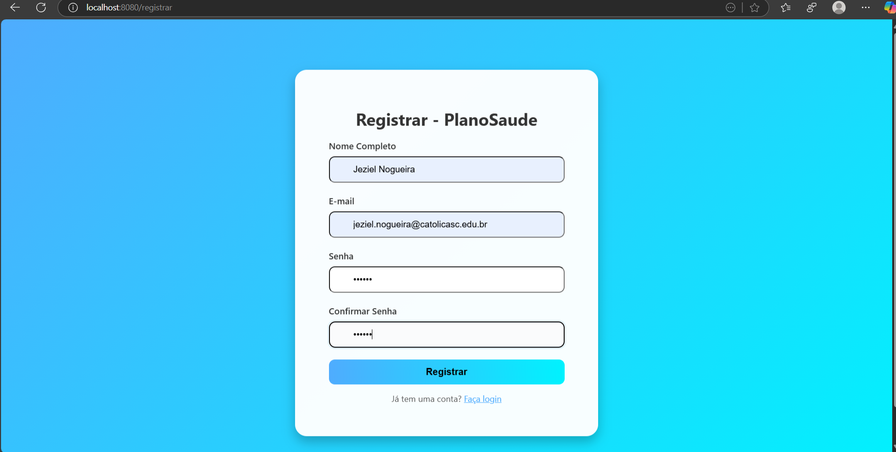
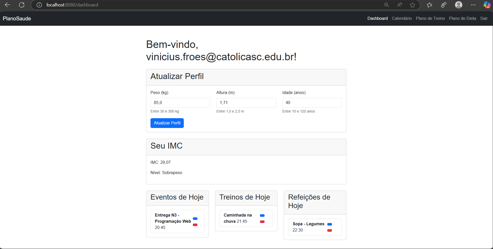
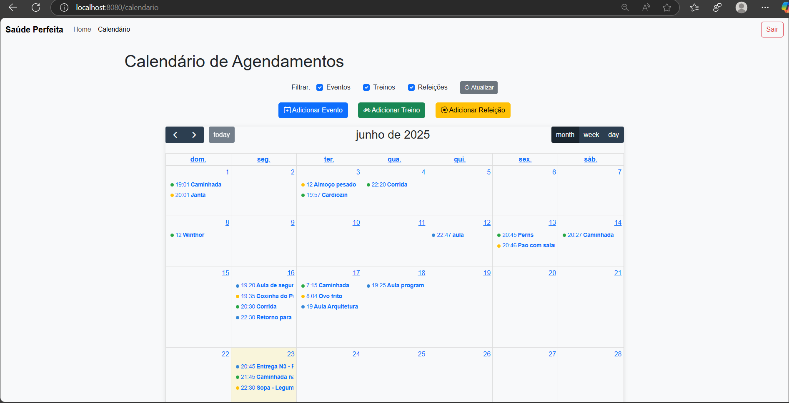

# PlanoSaude

PlanoSaude é uma aplicação web desenvolvida para gerenciar treinos, refeições, eventos e peso do usuário. Construída com Spring Boot, a aplicação suporta os padrões MVC (usando Thymeleaf) e MVVM (via APIs com Swagger).  
Foi desenvolvida por **Santhiago Chapiewski** e **Vinicius Froes**, com o intuito de atender aos pré-requisitos do projeto N3 da matéria **Programação WEB**, ministrada pelo professor **Leonardo Vitazik Neto**.  

## CENTRO UNIVERSITÁRIO – CATÓLICA DE SANTA CATARINA  
## JARAGUÁ DO SUL - SANTA CATARINA

## Requisitos

Criar uma aplicação web para gerenciar treinos, refeições e eventos (como consultas médicas), com suporte a padrões MVC e MVVM, incluindo:  
- **Front-end (MVC)**: Templates Thymeleaf para renderização de páginas (ex.: dashboard, treinos, eventos).  
- **Front-end (MVVM)**: APIs REST documentadas com Swagger, com pelo menos uma entidade exposta (Evento).  
- **Back-end**:  
  - 100% beans de persistência (mínimo duas entidades: Treino, Refeicao, Evento, UsuarioPeso).  
  - 100% acesso a dados com Spring Data JPA.  
  - Pelo menos um controller desenvolvido (PlanoController para MVC, controllers REST para MVVM).  
- **Validações**: Garantir que campos obrigatórios sejam preenchidos (ex.: descrição, data).  
- **Funcionalidades**: Adicionar, editar e remover treinos, refeições e eventos; visualizar dashboard com informações do dia.

## Funcionalidades

- Adicionar, editar e remover treinos, refeições e eventos.  
- Validação de conflitos de horário para eventos.  
- Dashboard com visão geral de treinos, refeições e eventos do dia.  
- APIs REST para gerenciar treinos, refeições e eventos (MVVM).  
- Suporte a monitoramento de peso (em desenvolvimento).  

## Tecnologias

- Java 17  
- Spring Boot 3.3.4  
- Spring Data JPA  
- MySQL (Banco de Dados)  
- Thymeleaf (MVC)  
- Swagger (MVVM)  
- Bootstrap  
- Lombok  
- SLF4J  

## Instalação

### Pré-requisitos
- Java 17 ou superior  
- Maven 3.8+  
- Git  
- MySQL 8.0+

### Passos
1. Clone o repositório:  
   ```
   git clone https://github.com/seu-usuario/plano-saude.git
   cd plano-saude
   ```
2. Configure o ambiente:  
   - Verifique o Java: `java -version`  
   - Verifique o Maven: `mvn -version`  
   - Configure o MySQL: Crie um banco de dados chamado `plano_saude`:
     ```sql
     CREATE DATABASE plano_saude;
     ```

3. Atualize `application.properties` com:  
   ```properties
   spring.datasource.url=jdbc:mysql://localhost:3306/plano_saude
   spring.datasource.username=seu-usuario
   spring.datasource.password=sua-senha
   spring.jpa.database-platform=org.hibernate.dialect.MySQLDialect
   spring.jpa.hibernate.ddl-auto=update
   ```

4. Execute a aplicação:  
   ```
   mvn clean install
   mvn spring-boot:run
   ```

5. Acesse:  
   - MVC: `http://localhost:8080`  
   - Swagger (MVVM): `http://localhost:8080/swagger-ui.html`

## Uso

1. Acesse o dashboard em `http://localhost:8080` para ver treinos, refeições e eventos do dia.  
2. Adicione um treino em `/treino`, uma refeição em `/alimentacao`, ou um evento em `/eventos`.  
3. Use o Swagger em `/swagger-ui.html` para gerenciar dados via API (ex.: `/api/eventos`).  
4. Edite ou remova registros diretamente nas respectivas páginas ou via API.

## Estrutura do Projeto

- `PlanoSaudeApplication.java`: Arquivo principal que inicializa a aplicação.  
- `config/`: Diretório de configurações.  
  - `AppConfig.java`: Configurações gerais da aplicação.  
  - `SwaggerConfig.java`: Configurações do Swagger para APIs.  
- `controller/`: Diretório de controllers.  
  - `PlanoController.java`: Controller MVC para interface web.  
  - `EventoController.java`: Controller REST para gerenciar eventos.  
  - `RefeicaoController.java`: Controller REST para gerenciar refeições.  
  - `TreinoController.java`: Controller REST para gerenciar treinos.  
- `model/`: Diretório de entidades.  
  - `Evento.java`: Entidade para eventos.  
  - `Refeicao.java`: Entidade para refeições.  
  - `Treino.java`: Entidade para treinos.  
  - `UsuarioPeso.java`: Entidade para monitoramento de peso.  
- `repository/`: Diretório de repositórios JPA.  
  - `EventoRepository.java`: Repositório para eventos.  
  - `RefeicaoRepository.java`: Repositório para refeições.  
  - `TreinoRepository.java`: Repositório para treinos.  
  - `UsuarioPesoRepository.java`: Repositório para peso.  
- `service/`: Diretório de serviços.  
  - `PlanoService.java`: Lógica de negócios da aplicação.  
- `resources/templates/`: Diretório de templates Thymeleaf.  
  - `dashboard.html`: Dashboard principal.  
  - `treino.html`: Página de treinos.  
  - `alimentacao.html`: Página de refeições.  
  - `evento.html`: Página de eventos.  
  - `calendario.html`: Página de calendário (em desenvolvimento).  

## Estrutura do Banco de Dados (MySQL)

O banco de dados `plano_saude` utiliza MySQL e contém as seguintes tabelas, criadas automaticamente pelo Spring Data JPA com `spring.jpa.hibernate.ddl-auto=update`.

### Tabelas

1. **usuario**
   - Descrição: Armazena informações dos usuários para autenticação e vinculação de dados.
   - Colunas:
     - `id` BIGINT PRIMARY KEY AUTO_INCREMENT
     - `email` VARCHAR(255) NOT NULL UNIQUE
     - `password` VARCHAR(255) NOT NULL
     - `nome` VARCHAR(255) NOT NULL

2. **plano_saude**
   - Descrição: Armazena informações sobre o plano de saúde do usuário, que agrupa eventos, refeições, treinos e registros de peso.
   - Colunas:
     - `id` BIGINT PRIMARY KEY AUTO_INCREMENT
     - `usuario_id` BIGINT NOT NULL (FOREIGN KEY REFERENCES usuario(id))
     - `nome` VARCHAR(255) NOT NULL
     - `data_inicio` DATETIME NOT NULL
     - `data_fim` DATETIME
   - Relacionamentos:
     - Chave estrangeira `usuario_id` vincula o plano a um usuário.

3. **evento**
   - Descrição: Armazena eventos, como consultas médicas, com título, datas e descrição.
   - Colunas:
     - `id` BIGINT PRIMARY KEY AUTO_INCREMENT
     - `usuario_id` BIGINT NOT NULL (FOREIGN KEY REFERENCES usuario(id))
     - `plano_saude_id` BIGINT (FOREIGN KEY REFERENCES plano_saude(id))
     - `title` VARCHAR(255) NOT NULL
     - `start` DATETIME NOT NULL
     - `end` DATETIME
     - `description` TEXT
   - Relacionamentos:
     - Chave estrangeira `usuario_id` vincula o evento a um usuário.
     - Chave estrangeira `plano_saude_id` (opcional) vincula o evento a um plano de saúde.

4. **refeicao**
   - Descrição: Registra refeições do usuário para acompanhamento alimentar.
   - Colunas:
     - `id` BIGINT PRIMARY KEY AUTO_INCREMENT
     - `usuario_id` BIGINT NOT NULL (FOREIGN KEY REFERENCES usuario(id))
     - `plano_saude_id` BIGINT (FOREIGN KEY REFERENCES plano_saude(id))
     - `descricao` VARCHAR(255) NOT NULL
     - `data` DATETIME NOT NULL
   - Relacionamentos:
     - Chave estrangeira `usuario_id` vincula a refeição a um usuário.
     - Chave estrangeira `plano_saude_id` (opcional) vincula a refeição a um plano de saúde.

5. **treino**
   - Descrição: Registra treinos do usuário para acompanhamento físico.
   - Colunas:
     - `id` BIGINT PRIMARY KEY AUTO_INCREMENT
     - `usuario_id` BIGINT NOT NULL (FOREIGN KEY REFERENCES usuario(id))
     - `plano_saude_id` BIGINT (FOREIGN KEY REFERENCES plano_saude(id))
     - `descricao` VARCHAR(255) NOT NULL
     - `data` DATETIME NOT NULL
   - Relacionamentos:
     - Chave estrangeira `usuario_id` vincula o treino a um usuário.
     - Chave estrangeira `plano_saude_id` (opcional) vincula o treino a um plano de saúde.

6. **usuario_peso**
   - Descrição: Armazena registros de peso do usuário para monitoramento.
   - Colunas:
     - `id` BIGINT PRIMARY KEY AUTO_INCREMENT
     - `usuario_id` BIGINT NOT NULL (FOREIGN KEY REFERENCES usuario(id))
     - `plano_saude_id` BIGINT (FOREIGN KEY REFERENCES plano_saude(id))
     - `peso` DECIMAL(5,2) NOT NULL
     - `data` DATETIME NOT NULL
   - Relacionamentos:
     - Chave estrangeira `usuario_id` vincula o peso a um usuário.
     - Chave estrangeira `plano_saude_id` (opcional) vincula o peso a um plano de saúde.

### SQL para Criação Manual (Opcional)
Se preferir criar o banco manualmente, use o seguinte script SQL:
```sql
CREATE DATABASE plano_saude;
USE plano_saude;

CREATE TABLE usuario (
    id BIGINT AUTO_INCREMENT PRIMARY KEY,
    email VARCHAR(255) NOT NULL UNIQUE,
    password VARCHAR(255) NOT NULL,
    nome VARCHAR(255) NOT NULL
);

CREATE TABLE plano_saude (
    id BIGINT AUTO_INCREMENT PRIMARY KEY,
    usuario_id BIGINT NOT NULL,
    nome VARCHAR(255) NOT NULL,
    data_inicio DATETIME NOT NULL,
    data_fim DATETIME,
    FOREIGN KEY (usuario_id) REFERENCES usuario(id)
);

CREATE TABLE evento (
    id BIGINT AUTO_INCREMENT PRIMARY KEY,
    usuario_id BIGINT NOT NULL,
    plano_saude_id BIGINT,
    title VARCHAR(255) NOT NULL,
    start DATETIME NOT NULL,
    end DATETIME,
    description TEXT,
    FOREIGN KEY (usuario_id) REFERENCES usuario(id),
    FOREIGN KEY (plano_saude_id) REFERENCES plano_saude(id)
);

CREATE TABLE refeicao (
    id BIGINT AUTO_INCREMENT PRIMARY KEY,
    usuario_id BIGINT NOT NULL,
    plano_saude_id BIGINT,
    descricao VARCHAR(255) NOT NULL,
    data DATETIME NOT NULL,
    FOREIGN KEY (usuario_id) REFERENCES usuario(id),
    FOREIGN KEY (plano_saude_id) REFERENCES plano_saude(id)
);

CREATE TABLE treino (
    id BIGINT AUTO_INCREMENT PRIMARY KEY,
    usuario_id BIGINT NOT NULL,
    plano_saude_id BIGINT,
    descricao VARCHAR(255) NOT NULL,
    data DATETIME NOT NULL,
    FOREIGN KEY (usuario_id) REFERENCES usuario(id),
    FOREIGN KEY (plano_saude_id) REFERENCES plano_saude(id)
);

CREATE TABLE usuario_peso (
    id BIGINT AUTO_INCREMENT PRIMARY KEY,
    usuario_id BIGINT NOT NULL,
    plano_saude_id BIGINT,
    peso DECIMAL(5,2) NOT NULL,
    data DATETIME NOT NULL,
    FOREIGN KEY (usuario_id) REFERENCES usuario(id),
    FOREIGN KEY (plano_saude_id) REFERENCES plano_saude(id)
);
```

### Observações
- O campo `data` em `refeicao`, `treino`, `usuario_peso`, e `plano_saude` usa `DATETIME` para armazenar data e hora, compatível com o formato `LocalDateTime` do backend.
- O campo `peso` em `usuario_peso` usa `DECIMAL(5,2)` para suportar pesos como `123.45` kg.
- As chaves estrangeiras garantem que cada registro esteja vinculado a um usuário válido. O campo `plano_saude_id` é opcional (NULLABLE) para permitir registros não associados a um plano específico.
- O `spring.jpa.hibernate.ddl-auto=update` cria/atualiza as tabelas automaticamente, but the SQL script can be used for manual initialization.

## Project Dependencies and Build Configuration

The project is built using Maven and relies on Spring Boot 3.3.4. Below are the key dependencies and build configurations defined in the `pom.xml`.

### Dependencies
- **Spring Boot Starters**:
  - `spring-boot-starter-web`: For building RESTful web services.
  - `spring-boot-starter-data-jpa`: For database access with Spring Data JPA.
  - `spring-boot-starter-validation`: For bean validation (e.g., `@NotNull`).
  - `spring-boot-starter-security`: For Spring Security authentication and authorization.
  - `spring-boot-starter-thymeleaf`: For server-side rendering with Thymeleaf templates.
  - `spring-boot-starter-actuator`: For monitoring and management endpoints.
- **SpringDoc OpenAPI**: `springdoc-openapi-starter-webmvc-ui` (2.6.0) for Swagger UI and API documentation.
- **Thymeleaf Security**: `thymeleaf-extras-springsecurity6` for integrating Spring Security with Thymeleaf.
- **MySQL Connector**: `mysql-connector-j` (9.1.0) for MySQL database connectivity (runtime scope).
- **DevTools**: `spring-boot-devtools` for hot reloading during development (runtime scope).
- **Lombok**: `lombok` (1.18.34) for reducing boilerplate code (provided scope).
- **Jackson**: `jackson-databind` for JSON serialization/deserialization.
- **Webjars**:
  - `bootstrap` (5.3.3) for CSS styling.
  - `bootstrap-icons` (1.13.1) for icons.
  - `jquery` (3.7.1) for JavaScript utilities.
  - `webjars-locator` (0.52) for resolving Webjars resources.
- **Test Dependencies**:
  - `spring-boot-starter-test`: For testing with JUnit and Spring Test.
  - `mockito-core` (5.14.1) for mocking in unit tests.
  - `h2` (2.3.232) for in-memory database during tests.
- **Custom Dependency**: `br.org.catolicasc:catrh:0.0.1-SNAPSHOT` (purpose not specified, assumed to be a local or institutional library).

### Build Configuration
- **Java Version**: 17
- **Maven Plugins**:
  - `spring-boot-maven-plugin`: Builds executable JAR, excludes Lombok from the final artifact.
  - `maven-compiler-plugin` (3.13.0): Compiles Java 17 code with Lombok annotation processing.
  - `maven-checkstyle-plugin` (3.5.0): Enforces Google Checkstyle rules during the `validate` phase (version 10.18.2).
  - `spotbugs-maven-plugin` (4.8.6): Performs static code analysis during the `verify` phase with maximum effort and low threshold.

### Notes
- Ensure the `br.org.catolicasc:catrh` dependency is available in your Maven repository or local build environment.
- The `mysql-connector-j` version (9.1.0) is newer than some older MySQL servers may support. Test connectivity or downgrade to `8.0.33` if needed.
- Checkstyle and SpotBugs enforce code quality, so run `mvn validate` and `mvn verify` to ensure compliance before building.

## Principais classes e telas e seu funcionamento

### Classes Principais
- **PlanoSaudeApplication.java**: Ponto de entrada da aplicação Spring Boot, inicializa o contexto da aplicação.
- **Entidades (model/)**:
  - **Evento.java**: Representa eventos (ex.: consultas médicas) com atributos como `id`, `usuario`, `planoSaude`, `title`, `start`, `end`, e `description`. Mapeia para a tabela `evento` no MySQL.
  - **Refeicao.java**: Modela refeições com `id`, `usuario`, `planoSaude`, `descricao`, e `data`. Persiste na tabela `refeicao`.
  - **Treino.java**: Define treinos com `id`, `usuario`, `planoSaude`, `descricao`, e `data`. Mapeia para a tabela `treino`.
  - **UsuarioPeso.java**: Registra peso do usuário com `id`, `usuario`, `planoSaude`, `peso`, e `data`. Persiste na tabela `usuario_peso`.
  - **PlanoSaude.java**: Representa um plano de saúde com `id`, `usuario`, `nome`, `dataInicio`, e `dataFim`. Vincula atividades à tabela `plano_saude`.
  - **Usuario.java**: Modela usuários com `id`, `email`, `password`, e `nome`, usado para autenticação e vinculação de dados.
- **Controllers (controller/)**:
  - **CalendarioController.java**: Gerencia eventos via APIs REST (`/api/eventos`). Inclui endpoints POST para criar e PUT para atualizar eventos, com validação de autenticação (Spring Security), título obrigatório, e formato de data (`ISO_LOCAL_DATE_TIME`).
  - **PlanoController.java**: Controller MVC que renderiza páginas Thymeleaf (ex.: dashboard, treinos) com dados dinâmicos.
  - **EventoController.java**, **RefeicaoController.java**, **TreinoController.java**: Controllers REST para gerenciar suas respectivas entidades via APIs.
- **Serviços (service/)**:
  - **PlanoService.java**: Contém lógica de negócios, como salvar eventos, refeições, treinos, e pesos, além de validações (ex.: conflitos de horário).
- **Repositórios (repository/)**:
  - **EventoRepository.java**, **RefeicaoRepository.java**, **TreinoRepository.java**, **UsuarioPesoRepository.java**: Interfaces JPA para acesso ao banco MySQL, com métodos CRUD padrão.

### Telas Principais
- **dashboard.html**: Página inicial que exibe um resumo das atividades diárias (eventos, treinos, refeições) do usuário autenticado. Usa Thymeleaf para renderizar dados dinâmicos do backend.
- **calendario.html**: Interface interativa com FullCalendar para visualizar e gerenciar eventos, treinos, e refeições. Inclui:
  - Modals para adicionar/editar registros com campos como título, data, e descrição.
  - Filtros para exibir apenas eventos, treinos, ou refeições.
  - Integração com APIs REST via AJAX, enviando dados com tokens CSRF para segurança.
- **treino.html**: Página para gerenciar treinos, com formulário para adicionar/editar registros (ex.: descrição, data).
- **alimentacao.html**: Similar a `treino.html`, mas para refeições, com campos para descrição e data.
- **evento.html**: Página para gerenciar eventos, com formulários validados para título, data inicial, data final, e descrição.

### Funcionamento
- **Fluxo do Usuário**:
  - Após login (autenticado via Spring Security), o usuário acessa o `dashboard.html` para ver atividades diárias.
  - Em `calendario.html`, pode visualizar eventos em um calendário, clicar em datas para adicionar novos registros, ou editar/excluir existentes via modals.
  - Páginas como `treino.html`, `alimentacao.html`, e `evento.html` permitem gerenciar atividades específicas via formulários.
- **Integração Front-Back**:
  - O frontend (`calendario.html`) usa AJAX para enviar dados aos endpoints REST (ex.: `POST /api/eventos`), incluindo tokens CSRF para segurança.
  - O backend (`CalendarioController.java`) valida entradas (ex.: título não vazio, formato de data), autentica o usuário, e persiste dados no MySQL via `PlanoService` e repositórios JPA.
  - Respostas JSON (ex.: `{ "success": true }` ou `{ "error": "mensagem" }`) são processadas pelo frontend para exibir alertas ou atualizar a interface.
- **APIs**:
  - Disponíveis via Swagger em `/swagger-ui.html`, permitem testar endpoints como `POST /api/eventos` e `PUT /api/eventos/{id}`.
  - Suportam CRUD para eventos, refeições, treinos, e pesos, com validação e autenticação.

### Telas com Imagens e Explicações
Abaixo estão capturas de tela das principais telas da aplicação, com descrições de suas funcionalidades:

- **Login**  
    
  - **Descrição**: Tela inicial para autenticação de usuários. Inclui campos para e-mail e senha, com um botão de login. Utiliza Spring Security para validação e redireciona para `dashboard.html` após sucesso. Inclui um link para a tela de registro.

- **Registro**  
    
  - **Descrição**: Tela para criação de novos usuários. Contém campos para nome, e-mail, e senha, com validação Thymeleaf para garantir dados obrigatórios. Após submissão, os dados são salvos no banco MySQL via `Usuario` entidade e redireciona para a tela de login.

- **Dashboard (dashboard.html)**  
    
  - **Descrição**: Exibe um resumo das atividades diárias do usuário autenticado, incluindo eventos, treinos, e refeições. A interface usa Bootstrap para layout e Thymeleaf para renderizar dados dinâmicos obtidos do backend via `PlanoController`. Inclui links para `calendario.html` e outras páginas.

- **Calendário (calendario.html)**  
    
  - **Descrição**: Mostra um calendário interativo usando FullCalendar, com eventos, treinos, e refeições coloridos por tipo. Permite clicar em uma data para abrir um modal com campos (título, data, descrição), enviar dados via AJAX para `POST /api/eventos`, e exibir filtros para tipos de atividades. Integra tokens CSRF para segurança.

## Contribuição

Contribuições são bem-vindas! Sinta-se à vontade para abrir issues e pull requests.

## Licença

Distribuído sob a [MIT License](LICENSE).
